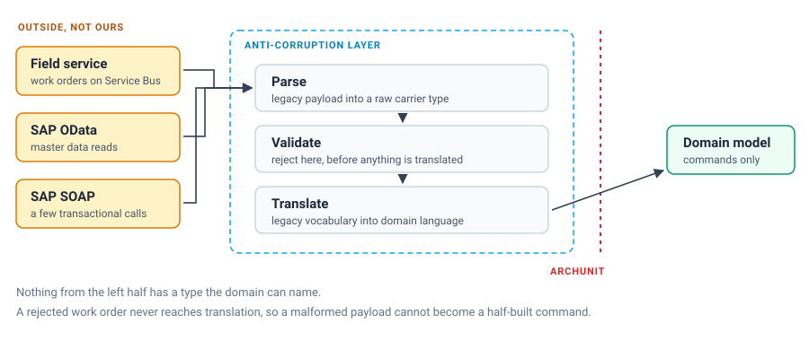

We spent real effort making the domain model for our property and metering platform clean: aggregates that only speak in domain language, invariants enforced in one place, events that read like sentences a domain expert would say out loud. None of that survives contact with a work order that originates from a legacy field-service system built two decades ago, where a device status arrives as the string `"4"`, a property reference is sometimes a plant code and sometimes a free-text address depending on which regional instance produced it, and a required field is occasionally just missing because a decades-old system does not enforce its own constraints consistently. If we let that shape leak into the domain, the domain stops being clean within a quarter.

An Anti-Corruption Layer is the deliberate decision to pay the translation cost once, at the boundary, in code that is explicitly allowed to be ugly, rather than paying it everywhere, forever, in code that is supposed to be beautiful.

## Where the mess enters

Two integration points bring legacy structure into our world. The first is work orders arriving on Azure Service Bus from a field-service platform that predates our system by a long time and will not be rewritten on our schedule. The second is SAP, which we integrate with over both OData (for master data reads) and SOAP (for a handful of transactional calls the SAP side never modernized past). Both are exactly the kind of external system a domain model should never see directly.

## Structure of the layer

The ACL is its own hexagonal adapter, deliberately isolated from the domain module by the same ArchUnit rules that protect every other boundary in the codebase. It has three stages, always in this order: parse, validate, transform.



```java
@Component
public class LegacyWorkOrderListener {

    private final LegacyWorkOrderParser parser;
    private final LegacyWorkOrderValidator validator;
    private final LegacyWorkOrderTranslator translator;
    private final ApplyDeviceLifecycleCommand applyCommand;

    @ServiceBusListener(destination = "legacy-work-orders")
    public void handle(ServiceBusReceivedMessage message) {
        LegacyWorkOrderRaw raw = parser.parse(message.getBody());
        ValidationResult result = validator.validate(raw);
        if (result.isInvalid()) {
            deadLetterWithReason(message, result);
            return;
        }
        DeviceLifecycleCommand command = translator.translate(raw);
        applyCommand.execute(command);
    }
}
```

`LegacyWorkOrderRaw` is a deliberately loose structure (mostly strings, mostly nullable, matching the wire format exactly) that never crosses into the domain module. It exists only inside the adapter package, and the ArchUnit rule from our architecture-enforcement setup (`domain must not depend on adapter`) makes that structural, not a matter of discipline.

## Validate before you translate, not after

Our first version of this layer tried to translate directly and let downstream domain invariants catch anything wrong. That was the wrong order, and it cost us an afternoon tracing a `NullPointerException` three layers deep in a command handler because a work order's device status field was absent rather than merely unexpected. The domain's job is to enforce business invariants on well-formed input, not to defend itself against malformed input from a system that does not share its assumptions. Now validation is an explicit, separate stage with its own vocabulary of what "acceptable" means at the boundary:

```java
public ValidationResult validate(LegacyWorkOrderRaw raw) {
    var errors = new ArrayList<String>();
    if (raw.deviceStatusCode() == null) {
        errors.add("deviceStatusCode is missing");
    } else if (!LEGACY_STATUS_CODES.containsKey(raw.deviceStatusCode())) {
        errors.add("unknown deviceStatusCode: " + raw.deviceStatusCode());
    }
    if (isBlank(raw.propertyReference())) {
        errors.add("propertyReference is missing");
    }
    if (raw.workOrderTimestamp() == null) {
        errors.add("workOrderTimestamp is missing");
    }
    return errors.isEmpty() ? ValidationResult.valid() : ValidationResult.invalid(errors);
}
```

Anything that fails validation goes to a dead-letter queue with the reason attached, not into a retry loop that will fail identically forever, and not into the domain where it would surface as a confusing, unrelated-looking exception. An operator or, more often now, an automated reconciliation job looks at the dead-letter reasons weekly. Malformed work orders from a legacy system are not exceptional: they are a steady, low background rate we plan for rather than treat as incidents each time.

## Translation is where the legacy vocabulary dies

Translation is the actual anti-corruption step: converting legacy codes and shapes into our ubiquitous language:

```java
public DeviceLifecycleCommand translate(LegacyWorkOrderRaw raw) {
    DeviceStatus status = LEGACY_STATUS_CODES.get(raw.deviceStatusCode());
    PropertyUnitId unitId = propertyReferenceResolver.resolve(raw.propertyReference());
    return new RecordDeviceStatusChange(
        unitId,
        status,
        Instant.parse(raw.workOrderTimestamp()),
        CausationMetadata.fromLegacySource(raw.workOrderId())
    );
}
```

`propertyReferenceResolver.resolve` is doing real work: it hides the fact that "property reference" means three different things depending on which regional instance of the legacy system produced the message, including a lookup against a mapping table we maintain specifically because the legacy system never unified its own identifiers. That resolver, and the `LEGACY_STATUS_CODES` map translating a numeric code to a domain enum, are the ugliest fifty lines in the entire codebase, and I am fine with that. Ugliness contained at a well-understood boundary is a cost we pay once. Ugliness that leaks is a cost we pay in every future feature that touches the domain.

## SAP: two protocols, one translation problem

SAP integration adds a second flavor of the same problem, with the extra twist that SAP is the source of truth for master data we do not own (property and asset master records), and OData responses come back with SAP's own field-naming conventions (`Werk`, `Anlage`, and other German-language internal SAP field names baked into the API surface regardless of what language the rest of the org runs in). We wrap the SAP OData client entirely behind a port:

```java
public interface AssetMasterDataPort {
    Optional<AssetMasterData> findByPropertyUnitId(PropertyUnitId unitId);
}
```

The SAP OData adapter implementing that port is the only place in the codebase that knows an SAP entity set is called `AssetMasterSet` or that a plant field is called `Werk`. For the handful of transactional writes we still make against SAP over SOAP (legacy endpoints SAP itself has not migrated), the adapter wraps a generated JAX-WS client and maps SOAP faults into our own `AssetSynchronizationFailed` domain-level exception, so a command handler catching integration failures never needs to know whether the underlying transport was SOAP or OData or anything else.

The hard lesson here was assuming SAP's OData responses were internally consistent across environments. A field that was reliably populated in our SAP test system came back null for a subset of real production plants, because those plants had been migrated from an even older SAP instance with incomplete data. Our first adapter did not defensively check for that null and produced property units with a null asset classification, which broke a billing report weeks later. The adapter now treats every SAP field as guilty until proven present, exactly like the legacy work-order parser does, because "this is enterprise software we do not control" turned out to be the same category of risk whether it arrives over a queue or an OData call.

## The payoff

None of this complexity is visible from inside the domain. A device status change looks identical to the domain model whether it originated from a clean internal API call or from a work order that spent a decade in a legacy field-service system before reaching us. That symmetry is the entire point of an Anti-Corruption Layer: not eliminating the mess, which is not ours to eliminate, but making sure it stops at a boundary we chose, in code we wrote specifically to absorb it, instead of spreading invisibly through every aggregate that happens to touch external data.
