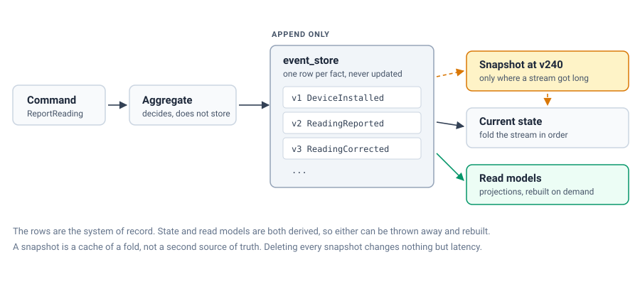

Every time I mention event sourcing, someone asks which message broker we run underneath it. The honest answer is none. The event store for the platform I work on, a system of record for property units and metering-device lifecycles, is a PostgreSQL table with a handful of indexes. No Kafka, no EventStoreDB, no exotic infrastructure. Just a relational database doing what it has always been good at: storing rows durably and letting you query them.

This is not a purity argument. It is a pragmatic one. We picked PostgreSQL because the team already runs it, knows how to back it up, and knows how to page someone at 3 a.m. when it misbehaves. Event sourcing does not require a specialized store: it requires an append-only log with strong consistency guarantees, and Postgres gives you that for free.

## What we are actually modeling

The domain is property units and the metering devices attached to them: think smart meters that get installed, recalibrated, swapped, and decommissioned over years, attached to units that get renovated, split, or merged. Every state change matters for billing disputes and regulatory audits years later. "What was the meter reading history for this unit in March 2024, and who triggered the device swap on the 14th?" is a question the business asks regularly, and it needs an answer, not a best guess reconstructed from mutable rows.

That requirement, full and provable history, is what pushed us toward event sourcing in the first place. State is not stored directly; it is derived by replaying the sequence of domain events that produced it.

## The event store schema

The core table is intentionally boring:

```sql
CREATE TABLE domain_event (
    sequence_number  BIGSERIAL PRIMARY KEY,
    stream_id        UUID NOT NULL,
    stream_type      TEXT NOT NULL,
    stream_version   BIGINT NOT NULL,
    event_type       TEXT NOT NULL,
    event_payload    JSONB NOT NULL,
    event_metadata   JSONB NOT NULL,
    occurred_at      TIMESTAMPTZ NOT NULL DEFAULT now(),
    CONSTRAINT uq_stream_version UNIQUE (stream_id, stream_version)
);

CREATE INDEX idx_domain_event_stream ON domain_event (stream_id, stream_version);
CREATE INDEX idx_domain_event_type ON domain_event (event_type);
```

`stream_id` identifies the aggregate: a metering device or a property unit. `stream_version` is a monotonically increasing counter per stream, and the unique constraint on `(stream_id, stream_version)` is the optimistic concurrency control mechanism: two concurrent commands trying to append version 7 to the same stream will have exactly one succeed, the other gets a constraint violation and retries against the fresh state.

Appending an event is a single INSERT inside the transaction that also validates business invariants: no distributed transaction, no dual-write problem, no outbox needed for the write side itself:

```kotlin
fun append(streamId: UUID, expectedVersion: Long, event: DomainEvent): Long {
    val nextVersion = expectedVersion + 1
    return namedParameterJdbcTemplate.queryForObject(
        """
        INSERT INTO domain_event (stream_id, stream_type, stream_version, event_type, event_payload, event_metadata)
        VALUES (:streamId, :streamType, :version, :eventType, :payload::jsonb, :metadata::jsonb)
        RETURNING sequence_number
        """,
        mapOf(
            "streamId" to streamId,
            "streamType" to event.streamType,
            "version" to nextVersion,
            "eventType" to event.type,
            "payload" to objectMapper.writeValueAsString(event),
            "metadata" to objectMapper.writeValueAsString(currentMetadata()),
        ),
        Long::class.java,
    )!!
}
```

If the unique constraint fires, we catch `DuplicateKeyException`, reload the stream, and let the command handler decide whether to retry. This is the entire concurrency story. No version vectors, no CRDTs, just a constraint Postgres has enforced correctly since before I started my career.



## Replay and state reconstruction

Reading a device's current state means loading its events in order and folding them into an aggregate:

```java
public MeteringDevice load(UUID deviceId) {
    List<DomainEvent> events = eventStore.readStream(deviceId);
    MeteringDevice device = MeteringDevice.empty(deviceId);
    for (DomainEvent event : events) {
        device = device.apply(event);
    }
    return device;
}
```

This is the part that makes people nervous ("you replay the entire history on every load?"), and the honest answer is yes, until it becomes a measurable problem. For most aggregates in our domain, a device accumulates a few hundred events over its lifetime. Folding a few hundred JSONB rows takes single-digit milliseconds. We measured before optimizing, which is the only rule of performance work that has never let me down.

## Snapshots, and the lesson that came with them

Some streams did grow large: property units that go through years of metering changes, tenant turnovers, and unit splits accumulated thousands of events. Loading those started showing up in our p99 latency dashboards, so we added snapshots:

```sql
CREATE TABLE aggregate_snapshot (
    stream_id       UUID PRIMARY KEY,
    stream_version  BIGINT NOT NULL,
    state_payload   JSONB NOT NULL,
    created_at      TIMESTAMPTZ NOT NULL DEFAULT now()
);
```

Loading now reads the latest snapshot, then replays only the events after `stream_version`. This is where I have my one incident story for this post. Our first snapshot implementation serialized the aggregate using the same Jackson-annotated class as the event payloads, and a routine refactor renamed a field on that class. Snapshots taken before the rename deserialized into an aggregate with a null field, silently, because Jackson's default behavior tolerates missing properties. Nobody noticed until a unit's billing calculation used a null meter reading and produced a negative invoice. The fix was to version snapshots explicitly (`schema_version` column) and fail loudly: deserialize into a versioned DTO, not the live domain class, so a schema mismatch throws instead of nulling a field. Snapshots are a cache, and caches need the same versioning discipline as any other contract. We do not extend that discipline to skipping validation on the events themselves, though: snapshots are purely a read-side optimization, and the event log stays the single source of truth. If a snapshot is ever suspect, we can delete it and rebuild from events with zero data loss.

## The audit trail is not a side effect

The feature that sells event sourcing internally, more than any architectural elegance, is that "who changed what, and when, and why" is answered by a query, not an investigation:

```sql
SELECT event_type, event_payload, event_metadata, occurred_at
FROM domain_event
WHERE stream_id = :deviceId
ORDER BY stream_version;
```

`event_metadata` carries the causation: the user or job that triggered the change, the correlation ID tying it back to an inbound work order, the API version that produced it. When a billing dispute lands on our desk, we do not reconstruct history from application logs with overlapping retention policies. We read the stream. This single capability has closed more support tickets than any dashboard we have built.

## Where CQRS comes in

We do not query the event store for anything read-heavy. Every event append also updates one or more read models (plain relational tables, sometimes materialized views), projected by listeners inside the same transaction or, for cross-service projections, via transactional outbox and a projector consuming its own durable cursor. The read models are disposable: if a projection is wrong, we truncate the table and replay the entire event log from sequence zero to rebuild it. That "just replay it" reset button, cheap because Postgres can stream a few million rows in seconds, has saved us from more than one bad migration.

## Why not Kafka

Kafka is excellent at what it is built for: high-throughput, multi-consumer distribution of events across service boundaries. But it is not an event store with query flexibility, and bolting event-sourcing semantics onto it (compacted topics, careful partition keys as stream IDs) recreates most of what a relational unique constraint already gives you, with a second piece of infrastructure to operate, back up and reason about failure modes for. For a single bounded context with a well-known, moderate write volume, PostgreSQL's transactional guarantees are the feature, not the limitation. We do publish integration events to other services after commit, via an outbox table and a relay, but that is a downstream concern from the store itself, not the store's job.

Start with what you already operate well. Reach for a specialized event store only when you have measured that Postgres cannot keep up. Running this in production for years now, that day has not come.

The complete runnable example (event store schema, optimistic concurrency, snapshots, Testcontainers suite) is on GitHub: [event-sourcing-postgres-example](https://github.com/heyimMarc/event-sourcing-postgres-example).
