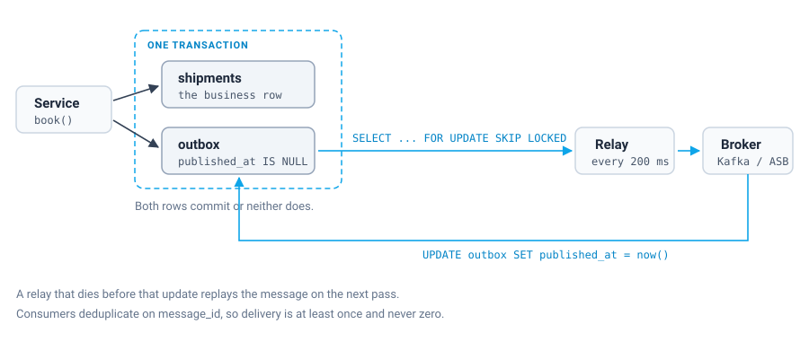

Writing to the database and publishing to a broker cannot be made safe by ordering them. Whichever one goes first, there is a moment where it has happened and the other has not, and processes die in moments like that. The [previous post](/posts/event-sourcing-postgresql/) got past all of this in a single clause: we publish integration events to other services through an outbox table and a relay. That clause hides the part people actually get wrong.

## The failure that has no safe ordering

A service changes something and has to tell the rest of the system. The obvious code writes the row, commits, then publishes:

```java
shipments.insert(shipment);      // committed
broker.publish(shipmentBooked);  // and if the process dies here?
```

If the JVM is killed between those two lines, the shipment exists and nothing downstream will ever hear about it. No retry helps, because the code that would have retried is gone.

Swap the two lines and you get the mirror image. The message goes out, the transaction rolls back on a constraint violation, and consumers now believe in a shipment that does not exist. Downstream systems start reserving capacity for freight nobody booked.

People try to close the gap by shrinking it. Publish in an `afterCommit` hook. Add a `try/catch` with a retry loop. Move the publish into a `finally` and wrap the whole thing in a helper with a reassuring name. All of that narrows the window without closing it, because the window is not the problem. The problem is that two systems are being changed and only one of them is inside a transaction.

The honest fix is to stop having two systems in the critical path. Write the message into the same database, in the same transaction as the business change:

```sql
BEGIN;
INSERT INTO shipments (...) VALUES (...);
INSERT INTO outbox (message_id, aggregate_id, message_type, payload, created_at) VALUES (...);
COMMIT;
```

Both writes land or neither does, guaranteed by the same transaction manager that already guarantees the business write. Delivery becomes a separate job that is allowed to fail and retry, because the message is durable the moment the business change is.



## The table

```sql
CREATE TABLE outbox (
    id             BIGSERIAL PRIMARY KEY,
    message_id     UUID NOT NULL UNIQUE,
    aggregate_id   UUID NOT NULL,
    message_type   TEXT NOT NULL,
    payload        JSONB NOT NULL,
    created_at     TIMESTAMPTZ NOT NULL,
    published_at   TIMESTAMPTZ,
    attempts       INT NOT NULL DEFAULT 0,
    last_error     TEXT
);

CREATE INDEX idx_outbox_unpublished ON outbox (id) WHERE published_at IS NULL;
```

Some of that needs defending.

`message_id` is separate from the primary key because it is the deduplication key that travels with the message. Consumers need something stable to remember, and a `BIGSERIAL` that only means something inside one database is the wrong thing to publish.

The index is partial. The relay only ever asks for rows where `published_at IS NULL`, and those are a small and roughly constant slice of a table that grows forever. A full index on `published_at` would keep every delivered row in it. This one lets published rows fall out. On a table we archive quarterly, that difference shows up in both index size and planning time.

`attempts` and `last_error` earn their space the first time something jams. A message stuck for six hours is an incident, and answering "which ones and why" with a single query beats correlating relay logs across three pods.

## The write that matters

The whole pattern lives or dies on one detail: the outbox insert has to run on the caller's connection.

```java
try (Connection connection = dataSource.getConnection()) {
    connection.setAutoCommit(false);
    try {
        shipments.insert(connection, shipment);
        outbox.add(connection, shipment.id(), "ShipmentBooked", payload, now);
        connection.commit();
    } catch (SQLException e) {
        connection.rollback();
        throw new IllegalStateException("failed to book shipment", e);
    }
}
```

I have reviewed more than one implementation where `OutboxRepository` took a `DataSource` and opened its own connection. It looks tidier. It is also a dual write again, wearing the costume of clean layering, and it fails exactly like the naive version it was meant to replace. Passing the `Connection` is ugly enough that nobody does it by accident, which in this case is a feature.

If you are on Spring, the same rule shows up as: the outbox write must join the ambient transaction, not start a new one with `REQUIRES_NEW`.

## The relay

A background job polls for unpublished rows, hands them to the broker, and marks what went out. In our case that broker is Azure Service Bus for work orders and Kafka on the side project; the relay does not care, and neither does the table.

The interesting part is what happens when two of them run, because eventually two of them will, whether you planned it or not.

```sql
SELECT id, message_id, aggregate_id, message_type, payload
FROM outbox
WHERE published_at IS NULL
ORDER BY id
LIMIT ?
FOR UPDATE SKIP LOCKED
```

`FOR UPDATE` alone would make the second relay block until the first commits, which turns your horizontal scaling into a queue. `SKIP LOCKED` tells Postgres to walk past rows another transaction holds and take the next free ones. Two relays then work disjoint batches at full speed, and no row is handed out twice.

This is the same primitive that makes Postgres a workable job queue, and it is old and boring. It is also the single line that most homegrown outbox implementations are missing, usually discovered when someone scales the deployment to two replicas and duplicate messages appear.

The rows stay locked until the transaction commits, so claim, publish and mark all happen in one transaction. A publish that throws leaves the row unpublished with the error recorded, and the next pass picks it up.

## At-least-once is the contract

The relay can publish successfully and die before it marks the row. The message then goes out twice. That is the guarantee the design offers, and treating it as a defect misreads the trade: the alternative is a distributed transaction across your database and your broker, which costs more than it is worth in almost every system I have worked on.

So the contract has to be stated out loud: every consumer deduplicates on `message_id`, or it is broken. Not "should", not "ideally". A consumer that assumes exactly-once will corrupt itself the first time a relay pod is evicted mid-batch, and it will do it quietly.

So put it in the message envelope, where whoever writes the consumer has to look at it, instead of in a wiki page nobody reads.

## Polling or reading the WAL

Debezium and logical decoding remove the poll entirely and are the better answer at high volume. They also add a component to operate, and a replication slot that stops being consumed holds WAL until the disk fills. That failure is quiet until it is catastrophic, and it happens on a Sunday.

Polling a partial index costs one cheap indexed query per interval. At our volumes it does not register, and when it breaks it breaks in a way that someone woken at 3 a.m. can reason about. Start with the poll. Move to decoding when you have measured that the poll hurts, not because it sounds more sophisticated.

## What we watch

Two numbers, both cheap:

```sql
SELECT count(*) FROM outbox WHERE published_at IS NULL;
SELECT max(now() - created_at) FROM outbox WHERE published_at IS NULL;
```

Depth tells you the relay is keeping up. Age tells you whether anything is stuck. Depth alone will lie to you: a queue of forty rows looks fine until you notice one of them has been sitting there since yesterday because a single malformed payload keeps failing while the rest flow past it. Age is what we page on.

## The ugly part

The outbox is not elegant. You are writing messages into a relational table and polling them back out, which offends people who feel that messages belong in a message broker. What it buys is that the guarantee you care about, business change and announcement being atomic, is enforced by the one transaction manager you already trust, instead of by hope and ordering.

A complete runnable example, including the atomicity tests and a test that runs two relays against the same table to prove `SKIP LOCKED` does what it claims, is on GitHub: [transactional-outbox-postgres-example](https://github.com/heyimMarc/transactional-outbox-postgres-example).
